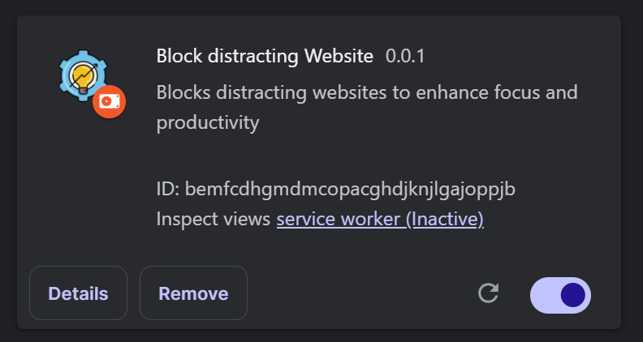

# Block distracting Websites (Chrome Extension)

# How to install this chrome extension locally

Follow these steps to install the Chrome extension on your browser:

### Step 1: Download the Extension Files

- Download the extension files as a folder or a .zip file.
- If it's a `.zip` file, extract it to get the folder containing the extension files.

### Step 2: Open the Chrome Extensions Page

- Open Google Chrome.
- Type the following URL in the address bar and press Enter:

```
chrome://extensions/
```

### Step 3: Enable Developer Mode

- At the top-right corner of the Extensions page, toggle the Developer mode switch to turn it on.

### Step 4: Load the Extension

- Click the "Load unpacked" button.
- In the file browser, navigate to the folder where you have saved the extension files.
- Select the folder and click "Open" or "Select Folder".

### Step 5: Verify Installation



- Once loaded, the extension will appear in the list of installed extensions on the Extensions page.
- If there are any errors, Chrome will show a warning. Make sure your files (especially manifest.json) are configured correctly.
